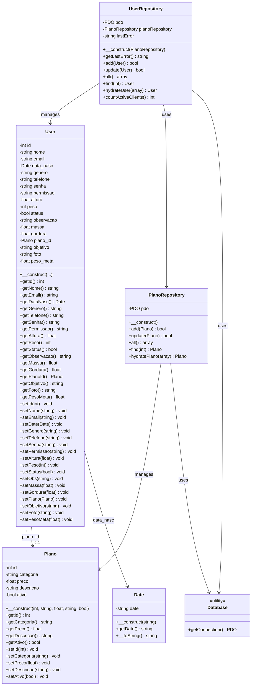

# Diagrama de Classes - SystemFy

## Relacionamentos

- **User** possui uma relação opcional (0..1) com **Plano** através do atributo `plano_id`
- **User** utiliza **Date** para representar a data de nascimento
- **UserRepository** gerencia objetos **User** e utiliza **PlanoRepository** para buscar planos
- **PlanoRepository** gerencia objetos **Plano**
- Ambos os repositórios utilizam **Database** para obter a conexão PDO

