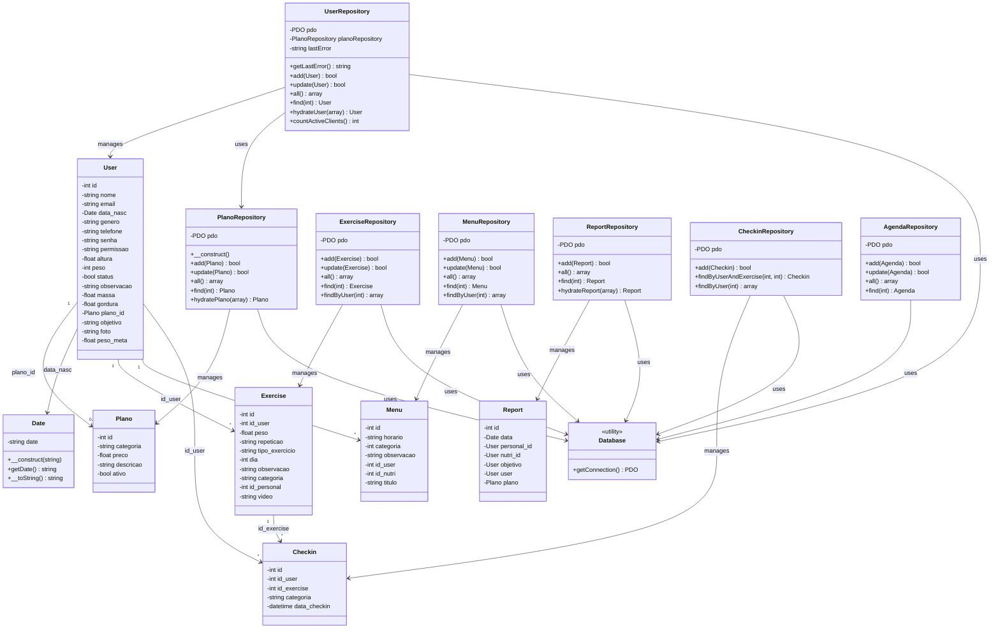

# Diagrama de Classes - SystemFy

## Relacionamentos

- **User** possui uma relação opcional (0..1) com **Plano** através do atributo `plano_id`
- **User** utiliza **Date** para representar a data de nascimento
- **User** possui múltiplos **Exercise** (1 para muitos)
- **User** possui múltiplos **Menu** (1 para muitos)
- **User** possui múltiplos **Checkin** (1 para muitos)
- **Exercise** possui múltiplos **Checkin** (1 para muitos)
- **UserRepository** gerencia objetos **User** e utiliza **PlanoRepository** para buscar planos
- **PlanoRepository** gerencia objetos **Plano**
- **ExerciseRepository** gerencia objetos **Exercise**
- **MenuRepository** gerencia objetos **Menu**
- **ReportRepository** gerencia objetos **Report**
- **CheckinRepository** gerencia objetos **Checkin**
- **AgendaRepository** gerencia objetos **Agenda**
- Todos os repositórios utilizam **Database** para obter a conexão PDO

